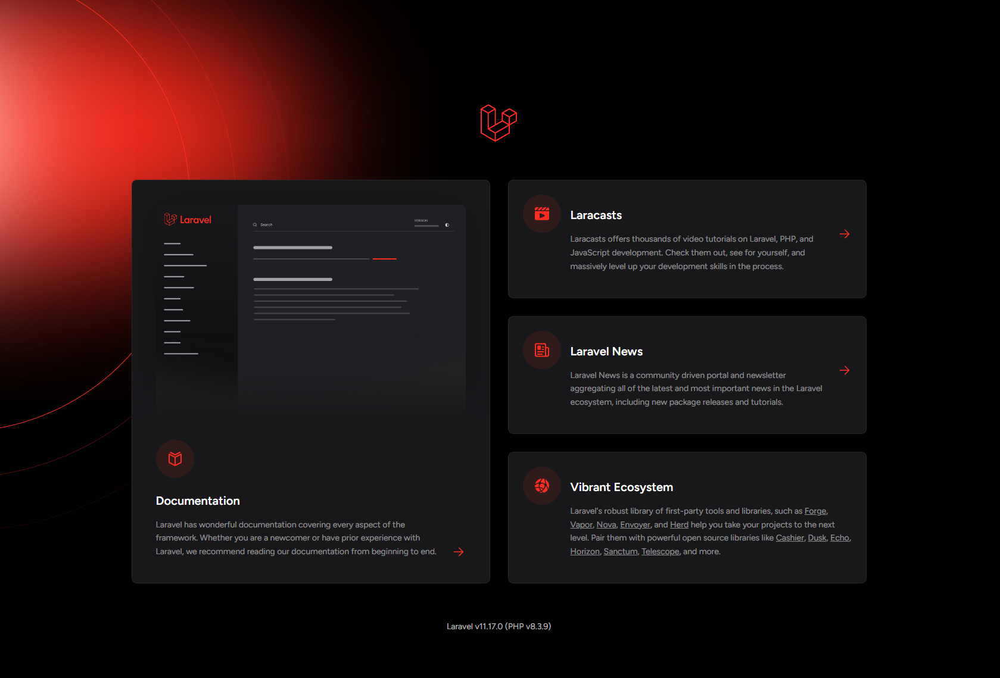

# Install Laravel With Composer

I showed you guys how to install Laravel Herd, which makes it easy to quickly setup a Laravel website in a couple clicks. However I also want to show you the standard way to install Laravel with Composer. So if you're not using Herd, you can get setup with this. Even if you are using Herd, you still want to watch this and get Composer installed on your machine.

## What Is Composer?

Composer is a package or a dependency manager for PHP. Just about every language has something similar for installing packages. With Node.js, you have NPM (Node Package Manager), with Ruby, you have RubyGems and with Python, you use pip (Python Package Installer). Composer can be used to install all kinds of software, Laravel included. It also offers autoloading of classes and other stuff. So regardless of how you install Laravel, you want to get Composer installed.

## Installing Composer

You can visit the official website for Composer at https://getcomposer.org. Depending on your OS, there are different ways to install Composer. 

## Mac Install

For mac, you can use Homebrew. If you don't have Homebrew installed, you can install it by running the following command in your terminal:

```bash
/bin/bash -c "$(curl -fsSL https://raw.githubusercontent.com/Homebrew/install/HEAD/install.sh)"
```

This will install Homebrew on your system.

#### Install Composer With Homebrew

To install composer on MacOS with Homebrew, simply run the following:

```bash
brew install composer
```

You can clean up the installation by running:

```bash
brew cleanup composer
```

To test it out, run the following:

```bash
composer
```

You should see a list of commands.

Composer is now installed.

## Windows Install

Go to the website https://getcomposer.org and click on the "Download" button. From here, you will see "Windows Installer". Click the link "Composer-Setup.exe". Once you download the file, run it and go through the installer and just select the defaults.

Now open up a terminal and run `composer`. If it says something like "Command not found", you need to restart your machine. I know this is a bit of a pain.

Now try running `composer` again. You should see a list of commands.

Composer is now installed.

## Laravel Installation

To install Laravel, open your terminal in the folder that you want to setup your project in and run the following:

```bash
composer create-project laravel/laravel workopia
```

This will create a new Laravel project in a folder called `workopia`.

Now navigate to the project folder:

```bash
cd workopia
```

Open VS Code:

```bash
code .
```

I
## Artisan

Laravel comes with an amazing command-line tool called Artisan. You can use Artisan to run commands to help you with your Laravel project. You can use it to create models, controllers, migrations, etc. You can also use it to run your Laravel project locally.

To see a list of available commands, run:

```bash
php artisan
```

You will see a bunch of commands including `serve`, `migrate`, `make:model`, `make:controller`, etc. We will be using Artisan a lot in this course.

## Running the Project

To run your Laravel project locally, run:

```bash
php artisan serve
```

This will start a local server at `http://localhost:8000`. You can now visit that URL in your browser to see your Laravel project. You should see the landing page.



We now have Laravel setup and our project running. In the next lesson, we'll take a look at the Laravel folder structure.

