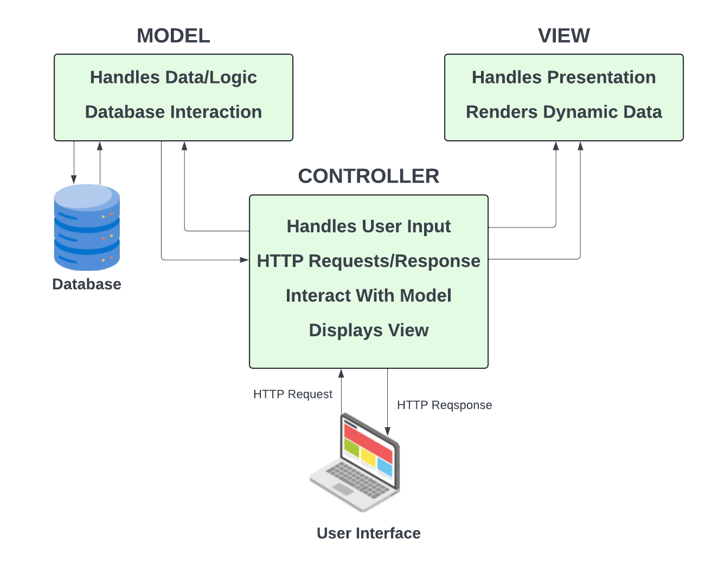

# MVC: How It Works

We looked at the Laravel folder structure in the last lesson and you saw that there are folders for models, views and controllers, so i just want to take a moment to explain what the Model-View-Controller (MVC) architectural pattern is.

MVC is a design pattern that separates an application into three main components. Each component has a specific role and interacts with the other components in a defined way. I personally think it should have been called the CMV pattern because the controller is typically the first to receive input from the user, then it processes the input using the model, and finally, it passes the data to the view for display.

A very simple explanation of the MVC pattern is:

- **Controller**: The controller acts as an entry point from the router and an intermediary between the model and the view. It receives input from the user, processes it using the model, and then passes the data to the view for display. In Laravel, controllers are responsible for handling HTTP requests and returning responses.

- **Model**: The model represents the data and business logic of the application. It interacts with the database to retrieve and store data. In Laravel, models are typically used to interact with the database tables.

- **View**: The view is responsible for presenting the data to the user. It is the user interface that the user interacts with. In Laravel, views are typically written in Blade, a templating engine that allows you to write HTML with embedded PHP code.



MVC Psuedo Code:

Let's look at some pseudo code to illustrate how the MVC pattern typically works. This is not actual Laravel code, but it should give you an idea of how the components interact with each other.

```php
// Controller
class UserController {
    public function index() {
        $users = User::all();
        return view('users.index', compact('users'));
    }
}

// Model
class User {
    public static function all() {
        return DB::table('users')->get();
    }
}

// View
@foreach ($users as $user)
    <p>{{ $user->name }}</p>
@endforeach
```

In this example, the controller receives a request to display all users. It then uses the User model to retrieve all users from the database. Finally, it passes the users data to the view for display.

So you can see the Controller is the first point of contact and acts as the middleman between the Model and the View. The Model is responsible for interacting with the database and the View is responsible for presenting the data to the user.

So hopefully this helps a bit. I think understanding the fundamentals of the MVC pattern is important when working with Laravel, as it will help you understand how the different components of the framework fit together.
