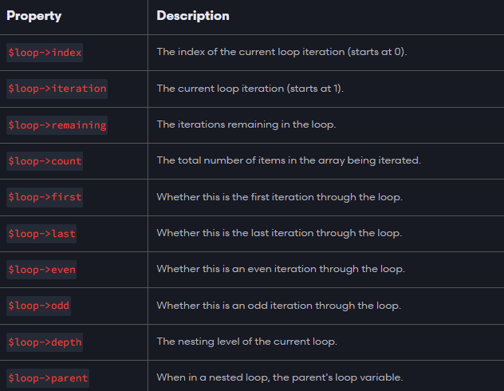

# More on Loops

There are some other directives that I want to show you that pertain to loops and iteration over arrays.

## @forelse & @empty Directives

Blade provides a `@forelse` directive that gives us a better way of looping and having something else show if the array is empty. Let's update our view file to display a message when there are no Jobs Found using the `@forelse` directive:

```php
  <ul>
    @forelse($jobs as $job)
      <li>{{ $job }}</li>
    @empty
      <li>No Jobs Found</li>
    @endforelse
  </ul>
```

I am going to use this instead of `@foreach` and `@if` because it is more readable and cleaner.

## @break Directive

Blade provides a `@break` directive that allows you to break out of a loop. Let's update our view file to display a message when there are no Jobs Found using the `@break` directive:

```php
<ul>
  @forelse($jobs as $job)
    @if($job === 'Web Developer')
      @break
    @endif
    <li>{{ $job }}</li>
  @empty
    <li>No Jobs Found</li>
  @endforelse
</ul>
```

Now it should not show any jobs after the Web Developer job.

## @continue Directive

Blade provides a `@continue` directive that allows you to skip an iteration of a loop. Let's update our view file to display a message when there are no Jobs Found using the `@continue` directive:

```php
<ul>
  @forelse($jobs as $job)
   @if($job === 'Web Developer')
        @continue
      @endif
    <li>{{ $job }}</li>
  @empty
    <li>No Jobs Found</li>
  @endforelse
</ul>
```

Now it should not show the Web Developer job.

## `$loop` Variable

Blade provides a `$loop` variable that allows you to access information about the current iteration of the loop. Here is a list of the available properties:



Let's try some of these out.

### `$loop->index`

This will return the index of the current iteration of the loop. Let's update our view file to display the index of the current iteration of the loop:

```php
<ul>
  @forelse($jobs as $job)
    <li>{{ $loop->index }} - {{ $job }}</li>
  @empty
    <li>No Jobs Found</li>
  @endforelse
</ul>
```

### `$loop->iteration`

This will return the iteration of the current iteration of the loop. Let's update our view file to display the iteration of the current iteration of the loop:

```php
<ul>
  @forelse($jobs as $job)
   <li>{{ $loop->iteration }} - {{ $job }}</li>
  @empty
    <li>No Jobs Found</li>
  @endforelse
</ul>
```

The difference between these two is that `iteration` will always start at 1, while `index` will start at 0.

### `$loop->remaining`

This will return the remaining iterations of the loop. Let's update our view file to display the remaining iterations of the loop:

```php
<ul>
  @forelse($jobs as $job)
   <li>{{ $loop->remaining }} - {{ $job }}</li>
  @empty
    <li>No Jobs Found</li>
  @endforelse
</ul>
```

### `$loop->count`

This will return the total number of iterations of the loop. Let's update our view file to display the total number of iterations of the loop:

```php
<ul>
  @forelse($jobs as $job)
   <li>{{ $loop->count }} - {{ $job }}</li>
  @empty
    <li>No Jobs Found</li>
  @endforelse
</ul>
```

### `$loop->first`

This will return true if the current iteration of the loop is the first iteration of the loop. Let's update our view file to display a message when the current iteration of the loop is the first iteration of the loop:

```php
<ul>
  @forelse($jobs as $job)
    @if($loop->first)
      <li>First: {{ $job }}</li>
    @else
        <li>{{ $job }}</li>
    @endif
  @empty
    <li>No Jobs Found</li>
  @endforelse
</ul>
```

### `$loop->last`

This will return true if the current iteration of the loop is the last iteration of the loop. Let's update our view file to display a message when the current iteration of the loop is the last iteration of the loop:

```php
<ul>
  @forelse($jobs as $job)
    @if($loop->last)
      <li>Last: {{ $job }}</li>
    @else
        <li>{{ $job }}</li>
    @endif
  @empty
    <li>No Jobs Found</li>
  @endforelse
</ul>
```

### `$loop->even`

This will return true if the current iteration of the loop is an even iteration of the loop. Let's update our view file to display a message when the current iteration of the loop is an even iteration of the loop:

```php
<ul>
  @forelse($jobs as $job)
    @if($loop->even)
      <li>Even: {{ $job }}</li>
    @else
        <li>{{ $job }}</li>
    @endif
  @empty
    <li>No Jobs Found</li>
  @endforelse
</ul>
```

### `$loop->odd`

This will return true if the current iteration of the loop is an odd iteration of the loop. Let's update our view file to display a message when the current iteration of the loop is an odd iteration of the loop:

```php
<ul>
  @forelse($jobs as $job)
    @if($loop->odd)
      <li>Odd: {{ $job }}</li>
    @else
        <li>{{ $job }}</li>
    @endif
  @empty
    <li>No Jobs Found</li>
  @endforelse
</ul>
```

These can be very helpful when you are working with loops.

We don't need to use these now, so I am going to remove them.

Your final view for now, will look like this:

```html
<!DOCTYPE html>
<html lang="en">
  <head>
    <meta charset="UTF-8" />
    <meta name="viewport" content="width=device-width, initial-scale=1.0" />
    <title>Jobs List</title>
  </head>

  <body>
    <h1>{{$title}}</h1>
    <ul>
      @forelse($jobs as $job)
      <li>{{ $job }}</li>
      @empty
      <li>No Jobs Found</li>
      @endforelse
    </ul>
  </body>
</html>
```

Now if you clear the array in the route, you will see the message `No Jobs Found`.
