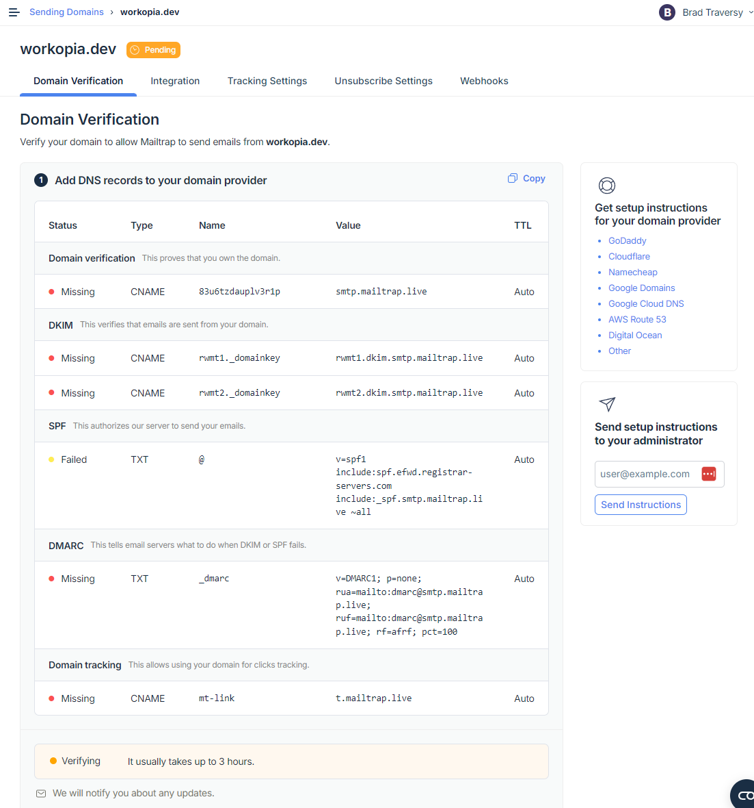

# Setup Emails for Production

Now that we know our email is working, we need to setup our email for production. We can still use Mailtrap for this. Go to https://mailtrap.io/home and click on "Star Sending" under "Email API/SMTP". It will ask for the domain you want to use. I have the domain `workopia.dev` registered at Namecheap. Use a domain that you own.

You should see a screen like this:



## Domain Setup

We need to add a few things in the domain registrar interface. I am using Namecheap so that is what this guide will be based on. If you are using a different registrar, the steps should be similar. There are instructions for other registrars on the right of this page.

Open Namecheap and go to the domain you want to use and click on "Manage".

Click on "Advanced DNS".

Click on "Add New Record".

Add the records that you see on the Mailtrap screen. For me, I added the following:

#### Domain Verification

- Type: CNAME
- Name/Host: 83u6tzdauplv3r1p
- Value: smtp.mailtrap.live
- TTL: Auto

#### DKIM Records

- Type: CNAME
- Name/Host: rwmt1.\_domainkey
- Value: rwmt1.dkim.smtp.mailtrap.live
- TTL: Auto

- Type: CNAME
- Name/Host: rwmt2.\_domainkey
- Value: rwmt2.dkim.smtp.mailtrap.live
- TTL: Auto

#### SPF Record

- Type: TXT
- Name/Host: @
- Value: v=spf1 include:spf.efwd.registrar-servers.com include:\_spf.smtp.mailtrap.live ~all
- TTL: Auto
  DMARC Record

- Type: TXT
- Name/Host: \_dmarc
- Value: v=DMARC1; p=none; rua=mailto:dmarc@smtp.mailtrap.live; ruf=mailto:dmarc@smtp.mailtrap.live; rf=afrf; pct=100
- TTL: Auto
  Domain Tracking

- Type: CNAME
- Name/Host: mt-link
- Value: t.mailtrap.live
- TTL: Auto

Now my Mailtrap page looks like this:


Everything is verified.

## Update Laravel

Now click on the `Integrations` tab and click on PHP and then the "Laravel 9+" Dropdown. You will see the following:

```php
MAIL_MAILER=smtp
MAIL_HOST=live.smtp.mailtrap.io
MAIL_PORT=587
MAIL_USERNAME=api
MAIL_PASSWORD=********8eaa
```

Now your app is ready to send emails, however, if you try this now, you may get the following message:

```
Expected response code "250" but got code "550", with message "550 5.7.1 Security check pending. Mailtrap is checking your domain credibility, it usually takes one business day.". (code: 550)
```

You may see a box in the Mailtrap interface that says "Complete Compliance Check". In order to use Mailtrap in production, you need to complete the compliance check. Click on the box and fill out the form. You will need to provide your domain, company name, and a few other details. Once you submit, it will take a day or so to get approved and you can start sending emails.
