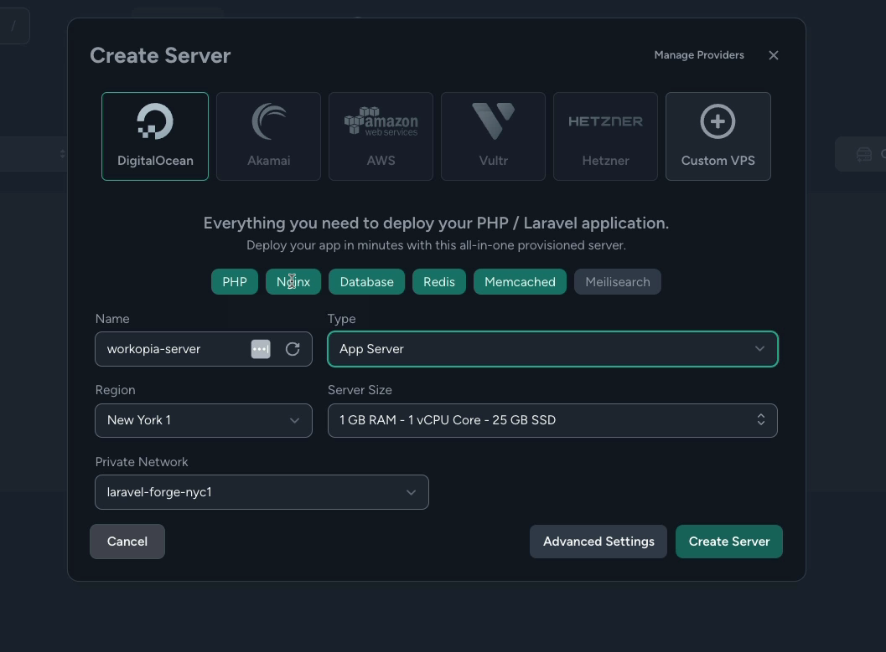
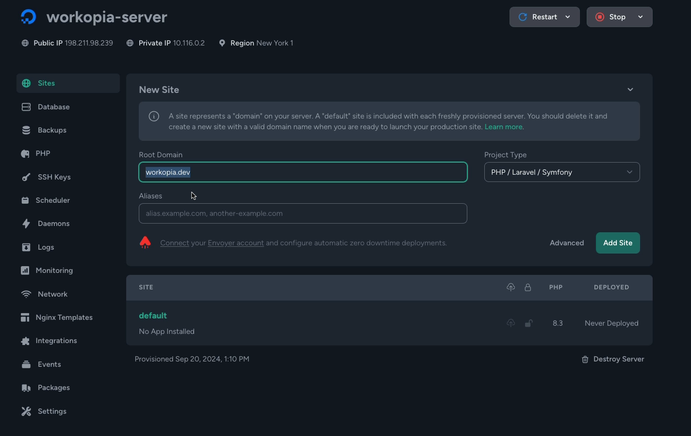
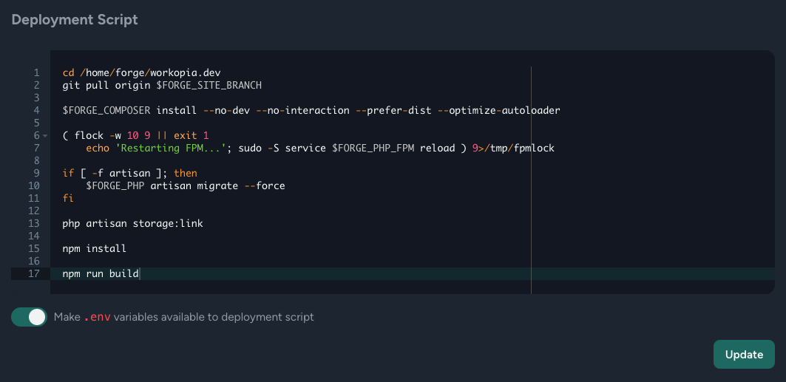

# Setup Laravel Forge

There are a lot of ways to deploy a Laravel project. Unfortunately, many of them are pretty difficult, especially if you are coming from a frontend development background.

## What is Laravel Forge?

Laravel Forge is a server management tool that makes it easy to deploy Laravel applications. It takes care of setting up your enviroment with everything from PHP to NGINX to your database. It is a paid service, but it is worth it. You can chose the "Hobby" plan for $12 per month. I really wanted to find a free solution for you guys, but the reality is that none really exist.

Forge itself does not host your application. It is just a tool that makes it easy to deploy your application to a server. You can use it with any server, but it is most commonly used with Digital Ocean and AWS. I prefer Digital Ocean because it is cheaper and easier to work with in my opinion.

You can use something like Digital Ocean, Linode or AWS on their own without Forge, but that is a lot of work to set up. There is a lot of provisioning that needs to be done and you really need to understand Lunux and the terminal. You need to manually install and configure all the software you need and you're almost guaranteed to run into issues unless you're really experienced.

## Create Server

You will need an account for both Forge and Digital Ocean. Let's head to https://forge.laravel.com/ and sign up for an account. Log in and you will see the dashboard. From here, you can create a new server.

You have a bunch of hosting options to choose from. I am going to use Digital Ocean. It will take you through the process of setting up your digital ocean account if you don't have one already.

Choose the pre-selected "App Server" option. You can leave the defaults for the rest as well. Click "Create Server".



It will show your sudo/ssh password and database password. Copy those and put them somewhere. It will take up to 10 - 15 minutes to set everything up.

## Create Site

Once you create a server, you can then create a site.

There will be a "default" site created already and that is what the public domain points to. You can use that if you want to access the site with the IP address. I am doing a full deployment with a domain and SSL, so I am going to use the "New Site" option and add my domain name.



Now select "Git Repository" and enter the URL of your Laravel app repo. Select the "main" branch.

You can choose the database name. Forge uses MySQL and I know we used Postgres in development, but it really doesn't matter because all of our code stays the exact same. The only difference is the .env config values, which Forge will update for us.

Click "Install Repository".

## Edit Deployment Script

Before we deploy, we need to edit the deployment script. This already includes things like running our migrations but we need to add a few things. Click on the "Edit Files" button and select "Edit Deployment Script". Add the following lines to the end of the script:

```bash
php artisan storage:link

npm install

npm run build
```



This will add our storage link, install the dependencies and run the build the frontend assets.

## Edit .env

Click the "Edit Files" button and select "Edit .env".

Add the following value at the bottom of the file:

```bash
MAPBOX_API_KEY=YOUR_API_KEY
```

If you plan on using mailing with Mailtrap, then also add your Mailtrap password and from email address.

Save the file.

Select "Make .env available to script" and click "Save".

Now, Deploy the project.

Once it says "Active", the project is deployed, but it is still not accessible because we need to setup the domain. We will do that next.

